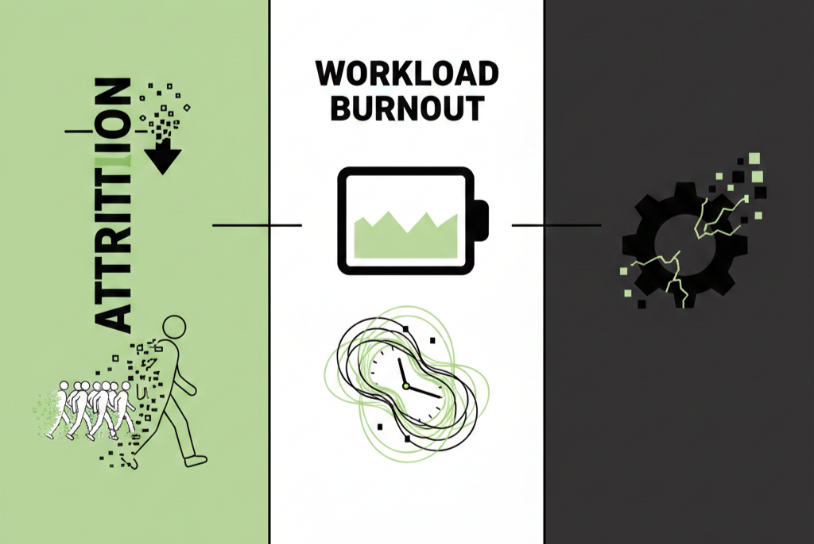

# Attrition and Workload Burnout in the Atlas Labs Workforce

## Skills
Power BI, DAX, data modelling, data analysis, data transformation and data visualization. 
## Project Context
Burnout results from chronic workplace stress that has not been successfully managed. It involves feelings of energy depletion, increased mental distance from one’s job, and reduced professional efficacy. While attrition (the natural departure of employees) is expected in any business, high turnover driven by burnout is a critical metric. This is typically measured using Key Performance Indicators (KPIs) such as attrition rate, average tenure, and reported job satisfaction scores.

Excessive workload, frequent business travel, and lack of work-life balance often predispose employees to burnout, leading to voluntary resignation and loss of institutional knowledge.

In this project, the Human Resources (HR) dataset for Atlas Labs was utilized, comprising comprehensive employee records including demographics, job roles, and performance metrics. The data was cleaned, filtered, and analyzed to isolate employees who had left the organization (Attrition = "Yes") to uncover patterns connecting overtime, salary hikes, and job satisfaction with their decision to leave. This work was conducted to demonstrate the application of people analytics in solving business problems.

Using Power BI, I developed an interactive and visually intuitive dashboard that produced several valuable insights on workforce dynamics at Atlas Labs and proffered data-driven retention strategies to mitigate burnout and reduce the financial impact of employee attrition.
## What I Analyzed

<i>Model View of Datasets</i>

I analyzed 6 tables: 5 were dimension tables(prefixed Dim), which included Employee, EducationLevel, RatingLevel, SatisfiedLevel and Date. All these were joined to the fact table (prefixed Fact), Performance Rating, which together conform to a star schema. An additional "table": _Measures, contained several measures like the percentage attrition rate, average salary, environmental satisfaction and many others I calculated using DAX. 

## Overview

The dashboard above displays some key performance indicators (KPIs):	Total Employees: 1470. Active Employees: 1233. Inactive Employees: 237. % Attrition Rate: 16.1%.
The stacked column chart shows employee hiring trends over the years, spanning 2012 to 2022, and the proportion of employees lost to attrition for each year of employment.
The bar chart shows that the Technology department has the highest number of active employees, followed by the Sales department, with Human Resources contributing the fewest. The treemap further breaks down each department by job roles and active employee count.
### Insights
The organization has a high overall attrition rate of 16.1%, indicating a significant systemic problem in retention, especially within core technical and sales roles like Software Engineer (inferred from treemap size) and Sales Representatives.

The hiring trends over the years do not show much variation in the ratio of active to inactive employees, implying that the onboarding process at Atlas Labs contributes little to attrition.

## Demographics

<i>Employee Demographics</i>

The Employees by Age column chart categorizes the workforce into age groups: <20, 20-29, 30-39, 40-49, 50>. We see that the majority of Atlas Labs' employees fall within the 20-29 age group, followed by 30-39, 40-49, and less than 20, with the employees aged 50 and above the fewest. The 100% stacked column chart shows the distribution of employees by gender among the different age groups.

Sorting the employees by marital status revealed that over 42% were married, about 37% single, and 20% divorced. 

Investigating the average salary of the employees among the broad ethnic groups present revealed significant disparity between the different ethnic groups represented. Whites (who happened to be the majority of the employees) and Native Hawaiians had the highest average salary. Besides other ethnic groups that were not clearly stated, employees of the mixed ethnic group had the lowest.
### Insights
Demographic information is key for tailoring benefits packages and wellness programs to the actual needs of the workforce. For instance, strategies targeted to the 20-29 age group (a period driven by career growth and competitive compensation), will reduce the attrition rate.
## Examining Attrition

<i>Attrition</i>

I took a deep dive into some employment conditions to connect attrition and burnout patterns. These included: department, job role, hire date, business travel frequency, overtime requirement and tenure of employment.

1. Sales representatives (Sales department) had the highest attrition rate in the organization.

2. The rate of attrition was significantly higher among employees who were required to work overtime.

3. 2017 had the lowest attrition rate.

4. Employees who had stayed less than 2 years had the highest attrition rates.

### Insights
1. This immediately directs HR and management to the most critical areas for intervention.

2. A high attrition rate for employees with overtime is a direct indicator of burnout and work-life balance failure.

3. The data confirms high attrition among employees with frequent business travel and overtime, a clear sign that workload and demands are unsustainable, directly impacting employee well-being.

## Employee Performance Tracker

<i>Performance Tracker</i>

The dashboard above shows many important metrics (satisfaction level and rating) that affect attrition. The clear definition of a 5-point rating scale (for performance) and a satisfaction scale provides a standardized, quantifiable way to measure qualitative data. This is crucial for comparing performance and satisfaction across the company.

Individual trend charts	track historical scores for Self Rating, Manager Rating, Environment Satisfaction, Relationship Satisfaction, and Work Life Balance over the Year. A dropdown slicer at the top left enables selecting a particular employee (Alethea Heeney is selected in the dashboard currently).
### Insights
A growing divergence between Self Rating and Manager Rating is a strong sign of dissatisfaction and potential attrition. 

Similarly, a declining trend in Work Life Balance and Environment Satisfaction scores, especially in the 1-2 years leading up to the current date, signals an employee is at high risk of leaving, even if their Manager Rating remains high.

## Recommendations
#### Implement a Targeted Retention Strategy for High-Risk Roles
Focus resources on the statistically highest-risk groups identified on the Attrition page, particularly Sales Representatives and specific roles within the Technology department. This involves conducting "stay interviews" with employees in these specific roles, asking focused questions about workload, management support, and career opportunities to gather qualitative data that complements the quantitative dashboard data.

Then, create a "Retention Dashboard Filter" that allows managers of these "hotspot" departments to track the satisfaction and performance metrics of their most vulnerable employees (e.g., those with declining Work Life Balance scores) in real-time. This will enable proactive intervention rather than reactive exit interviews.

#### Establish a Proactive Career Development and Compensation Review Program
Given the predominantly young, ambitious demographic (20-39 age group), the organization must address the need for a clear path upward. The high attrition suggests employees are leaving for better career opportunities elsewhere. A structured program should be implemented that guarantees a career path review and competitive market compensation.

#### Mandate and Enforce a Work-Life Balance Policy
This stems from the apparent correlation between high attrition and metrics like overtime and frequent business travel. A formal, top-down policy must be introduced that limits overtime (including voluntary overtime) and implements mandatory rest periods after extensive business travel. 

